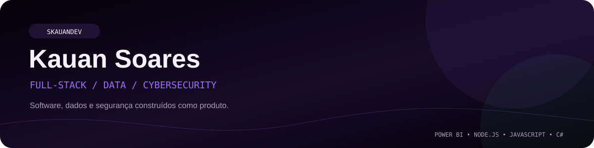
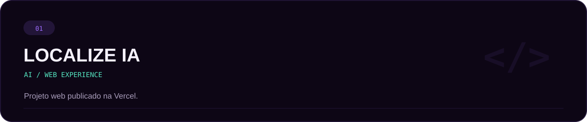
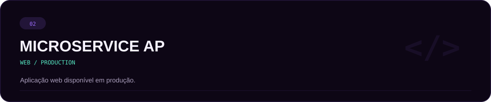
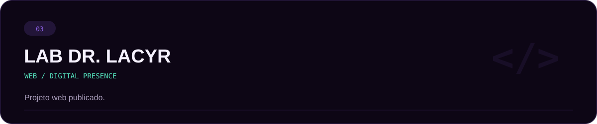
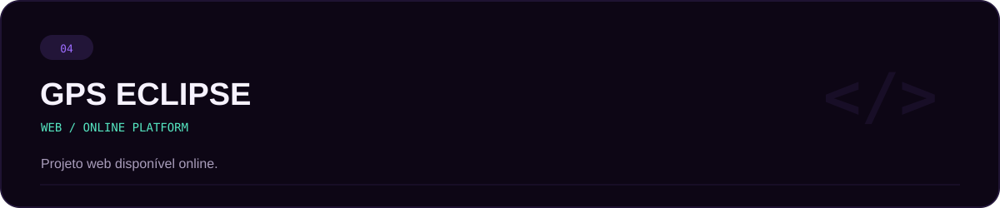
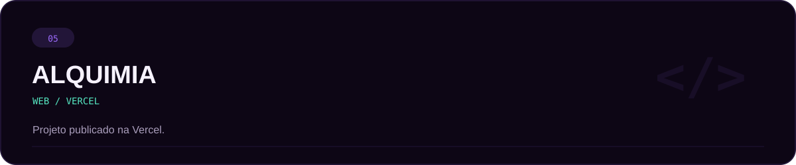

  

 

### Kauan Victor Costa Bruno Soares
**Full-Stack Developer • Analista de Dados • CyberSecurity**

[LinkedIn](https://www.linkedin.com/in/kauan-soares-software-developer-20a97a367) •
[Instagram](https://www.instagram.com/dev.soareskauan)

## `01 // SOBRE`

Atuo na interseção entre **desenvolvimento de software, dados e segurança**, criando aplicações e soluções digitais com foco em transformar necessidades reais em produtos funcionais.

Minha stack atual passa por **Node.js, JavaScript, C# e Power BI**, além de projetos relacionados a **CyberSecurity**.

Este perfil reúne alguns dos projetos e trabalhos que fazem parte da minha trajetória profissional.

## `02 // ESPECIALIDADES`

<table>
<tr>
<td width="33%" align="center">

### `FULL-STACK`
Aplicações e experiências web.

**Node.js • JavaScript • C#**

</td>
<td width="33%" align="center">

### `DATA`
Análise e visualização de dados.

**Power BI**

</td>
<td width="33%" align="center">

### `SECURITY`
Tecnologia com olhar para segurança.

**CyberSecurity**

</td>
</tr>
</table>

## `03 // STACK`

  

`POWER BI` &nbsp;&nbsp; `NODE.JS` &nbsp;&nbsp; `JAVASCRIPT` &nbsp;&nbsp; `C#` &nbsp;&nbsp; `CYBERSECURITY`

## `04 // PROJETOS SELECIONADOS`

## `05 // DEMONSTRAÇÕES`

Além dos projetos publicados acima, também compartilho demonstrações de trabalhos no Instagram:

**[Projeto 01 ↗](https://www.instagram.com/reel/DVwNMe4CMKn/)** &nbsp; • &nbsp;
**[Projeto 02 ↗](https://www.instagram.com/reel/DTnbYNyjTZr/)** &nbsp; • &nbsp;
**[Projeto 03 ↗](https://www.instagram.com/reel/DZnJOKwBA6K/)**

## `06 // GITHUB`

<table>
<tr>
<td width="33%" align="center">

### `PROFILE`
**SKauanDev**

Projetos, experimentos e evolução técnica.

</td>
<td width="33%" align="center">

### `FOCUS`
**Software + Dados + Segurança**

Construção de soluções com visão de produto.

</td>
<td width="33%" align="center">

### `STACK`
**Node.js • JavaScript • C# • Power BI**

Tecnologias presentes no meu trabalho atual.

</td>
</tr>
</table>

> Preferi remover os cards externos de Stats e Top Languages porque estavam quebrando na renderização do GitHub. Esta seção agora usa apenas conteúdo nativo e estável.

## `07 // CONTRIBUIÇÕES`

O gráfico de contribuições do GitHub já aparece nativamente no perfil, então removi a Snake até que exista uma branch `output` válida e estável no repositório.

Se eu reativar essa animação depois, ela entra somente quando o workflow estiver comprovadamente gerando os arquivos corretamente — sem deixar imagem quebrada no README.

## `08 // CONTATO`

### Vamos nos conectar.

**Kauan Victor Costa Bruno Soares**

Full-Stack Developer • Analista de Dados • CyberSecurity

 

**[LinkedIn](https://www.linkedin.com/in/kauan-soares-software-developer-20a97a367)** &nbsp; • &nbsp;
**[Instagram @dev.soareskauan](https://www.instagram.com/dev.soareskauan)**

  

